<div align="center">
  <h1>🖼️ ImageInsightLLM</h1>
  <h3>Modern Edge Agent: Image Captioning, OCR, Summarization & Text-to-Image Generation</h3>
  
  
  
</div>

---

## 🚀 Overview

**ImageInsightLLM** is a creative, edge-ready Streamlit app that transforms your images and ideas into meaningful captions, summaries, and even new AI-generated visuals! Powered by open-source LLMs, BLIP, OCR, and Hugging Face APIs, it’s your all-in-one visual intelligence agent.

---

## ✨ Features

- **Image Captioning**: Upload any image and get a smart, context-aware caption using BLIP (Salesforce/blip-image-captioning-base).
- **OCR (Text Extraction)**: Extracts readable text from images using EasyOCR, filtering for clarity and relevance.
- **Dynamic Summarization**: Combines the image caption and extracted text, then summarizes it with a state-of-the-art LLM (facebook/bart-large-cnn).
- **Text-to-Image Generation**: Enter a prompt and generate a brand new image using Hugging Face’s FLUX.1-dev model.
- **Edge-Ready**: Designed to run efficiently on local devices—no GPU required for core features.
- **Modern UI**: Clean, tabbed Streamlit interface for seamless user experience.

---


##  🔀  App Flow

### 1. Image Captioning Tab
1. **Upload Image** → 2. **Caption Generated (BLIP)** → 3. **OCR Text Extraction** → 4. **Dynamic LLM Summary**
   - If text is found: Caption + Text → Summarized.
   - If no text: Caption alone is summarized.


### 2. Text-to-Image Generation Tab
1. **Enter Prompt** → 2. **Image Generated via Hugging Face API** → 3. **View & Download**

---

## 🧪 Examples

### Image Captioning Example

1. **Upload Image:** 
2. **Generated Caption:**
   > "A group of people standing on top of a mountain with their hands raised."
3. **Extracted Text:**
   > (If present in the image, e.g., "SUMMIT 2025")
4. **Summary:**
   > "A group of people celebrate at the mountain summit. The text 'SUMMIT 2025' is visible."

### Text-to-Image Generation Example

1. **Prompt:**
   > "A futuristic city skyline at sunset, with flying cars and neon lights."
2. **Generated Image:**
   > 
3. **Result:**
   > The app displays the generated image with your prompt as the caption.


---


## 🔄 Visual Flowchart

```mermaid
flowchart TD
    A[🖼️ ImageInsightLLM App Start] --> B{User Selects Tab}
    %% Image Captioning Flow
    B -->|Tab 1| C[📸 Image Captioning Tab]
    C --> D[📤 Upload Image<br/>JPG/JPEG/PNG]
    D --> E{Image Uploaded?}
    E -->|No| D
    E -->|Yes| F[🖼️ Display Uploaded Image]
    F --> G[🤖 Load BLIP Model<br/>Salesforce/blip-image-captioning-base]
    G --> H[🔍 Generate Image Caption<br/>BLIP Processing]
    H --> I[✅ Display Caption Result]
    I --> J[🔤 Start OCR Process<br/>EasyOCR Reader]
    J --> K[📝 Extract Text from Image]
    K --> L[🎯 Filter Text<br/>Confidence > 0.5<br/>Length > 2 chars<br/>Alphabetic only]
    L --> M{Text Found?}
    M -->|Yes| N[📄 Display Extracted Text]
    M -->|No| O[ℹ️ No Text Detected]
    N --> P[🧠 Prepare Summary Input<br/>Caption + Extracted Text]
    O --> Q[🧠 Prepare Summary Input<br/>Caption Only]
    P --> R[🤖 Load BART Summarizer<br/>facebook/bart-large-cnn]
    Q --> R
    R --> S[⚙️ Generate Dynamic Summary]
    S --> T{Summary Success?}
    T -->|Yes| U[✨ Display AI Summary]
    T -->|No| V[⚠️ Fallback Summary<br/>Manual Template]
    U --> W[🎉 Process Complete]
    V --> W
    %% Text-to-Image Flow
    B -->|Tab 2| X[🎨 Text-to-Image Generation Tab]
    X --> Y[✍️ Enter Text Prompt]
    Y --> Z{Prompt Entered?}
    Z -->|No| Y
    Z -->|Yes| AA[🚀 Click Generate Image Button]
    AA --> BB[🔄 Loading Spinner Active]
    BB --> CC[🌐 Call Hugging Face API<br/>black-forest-labs/FLUX.1-dev]
    CC --> DD[📡 Send POST Request<br/>with Authorization Token]
    DD --> EE{API Response?}
    EE -->|Success 200| FF[📥 Receive Image Data]
    EE -->|Error| GG[❌ Display Error Message]
    FF --> HH{Image Format?}
    HH -->|Raw Binary| II[🖼️ Convert BytesIO to PIL Image]
    HH -->|Base64 JSON| JJ[🔓 Decode Base64 to PIL Image]
    II --> KK[🎨 Display Generated Image]
    JJ --> KK
    GG --> LL[🔄 Ready for Next Attempt]
    KK --> MM[🎉 Generation Complete<br/>Image Ready for Download]
    %% Styling
    classDef startEnd fill:#e1f5fe,stroke:#01579b,stroke-width:3px,color:#000
    classDef process fill:#f3e5f5,stroke:#4a148c,stroke-width:2px,color:#000
    classDef decision fill:#fff3e0,stroke:#e65100,stroke-width:2px,color:#000
    classDef success fill:#e8f5e8,stroke:#2e7d32,stroke-width:2px,color:#000
    classDef error fill:#ffebee,stroke:#c62828,stroke-width:2px,color:#000
    classDef model fill:#f1f8e9,stroke:#33691e,stroke-width:2px,color:#000
    class A,W,MM,LL startEnd
    class C,D,F,G,H,I,J,K,L,N,O,P,Q,R,S,X,Y,AA,BB,CC,DD,FF,II,JJ,KK process
    class B,E,M,T,Z,EE,HH decision
    class U,MM success
    class GG,V error
    class G,R,CC model
```



---

## 🗂️ Project Structure

```
ImageInsightLLM/
├── app.py                # Main Streamlit app
├── requirements.txt      # Python dependencies
├── Dockerfile            # Containerization support
├── .env                  # Hugging Face API token (not committed)
├── test_hf_token.py      # Token validation script
├── README.md             # Project documentation
├── LICENSE               # MIT License
```

---

## 🛠️ Quickstart

1. **Clone the repo:**
   ```bash
   git clone https://github.com/NikithaKunapareddy/ImageInsightLLM.git
   cd ImageInsightLLM
   ```
2. **Set up Python 3.11** (required)
3. **Install dependencies:**
   ```bash
   pip install -r requirements.txt
   ```
4. **Add your Hugging Face token:**
   - Create a `.env` file:
     ```env
     HF_TOKEN=your_huggingface_token
     ```
5. **Run the app:**
   ```bash
   streamlit run app.py
   ```

---

## 📦 Requirements

- Python 3.11
- See `requirements.txt` for all dependencies

---


## 🤖 Model & API Credits

**LLMs actually used in this app:**

- **Summarization LLM:** [facebook/bart-large-cnn](https://huggingface.co/facebook/bart-large-cnn) (for dynamic text/image summaries)
- **Image Captioning LLM:** [Salesforce/blip-image-captioning-base](https://huggingface.co/Salesforce/blip-image-captioning-base) (for generating captions from images)
- **Text-to-Image LLM:** [black-forest-labs/FLUX.1-dev](https://huggingface.co/black-forest-labs/FLUX.1-dev) (for generating images from text prompts)

**Other core components:**
- **OCR**: [EasyOCR](https://github.com/JaidedAI/EasyOCR)
- **UI**: [Streamlit](https://streamlit.io/)

### 🧩 Open-Source LLMs for 8GB RAM

This project is designed to work with open-source LLMs that are suitable for machines with 8GB of RAM. Some recommended models you can try:

- **DistilBART** ([sshleifer/distilbart-cnn-12-6](https://huggingface.co/sshleifer/distilbart-cnn-12-6)) – lightweight summarization LLM
- **DistilGPT2** ([distilgpt2](https://huggingface.co/distilgpt2)) – compact text generation
- **TinyLlama** ([TinyLlama/TinyLlama-1.1B-Chat-v1.0](https://huggingface.co/TinyLlama/TinyLlama-1.1B-Chat-v1.0)) – chat and general LLM tasks
- **Phi-2** ([microsoft/phi-2](https://huggingface.co/microsoft/phi-2)) – efficient and small LLM for reasoning

These models are open-source, easy to run locally, and ideal for edge devices or laptops with limited memory.

---

## 🌟 Acknowledgments

- Hugging Face for their open models & API
- Salesforce Research for BLIP
- Facebook AI for BART
- JaidedAI for EasyOCR
- Streamlit for rapid prototyping
- All open-source contributors & the Python community

---

## 🧠 Inspiration & Vision

ImageInsightLLM was built to empower users with instant, intelligent visual understanding—right from their desktop. Whether you’re a developer, researcher, or creative, this app brings the power of multimodal AI to your fingertips.

---


<div align="center">
  <b>✨ Thank you for exploring ImageInsightLLM! 🚀<br>
  Unleash the power of vision and language—right from your desktop. 🌟🖼️🤖</b>
</div>

## 📝 License

MIT License. See [LICENSE](LICENSE) for details.
